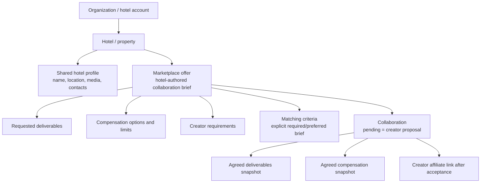

# Marketplace offer model

VAY-1012 defines the canonical Marketplace model. Marketplace does not own a
second hotel listing and does not introduce a campaign or opportunity layer.

## Ownership

- `identity.organizations` owns the hotel account and membership.
- `hotel_catalog.properties` owns each hotel. Its public profile owns hotel
  identity, classification, location, contacts, descriptions, and media.
- `marketplace.marketplace_offers` owns the collaboration brief: title,
  summary, lifecycle state, and Marketplace metadata.
- `marketplace.offer_deliverables` owns the content requested by the hotel,
  including platform, type, quantity, and timing guidance.
- `marketplace.offer_compensation_options` owns the compensation modes and
  limits the hotel is willing to consider. These are not creator proposals.
- `marketplace.offer_creator_requirements` owns eligibility criteria.
- `marketplace.offer_matching_criteria` owns the optional versioned campaign
  goal, timing, content, usage, effort/value, revision, and application-capacity
  document. Absence and nullable requirement levels mean unknown; they do not
  silently become hard filters.
- `marketplace.collaborations` represents the creator proposal while pending
  or negotiating and the agreement after acceptance. Accepted terms and
  deliverables are snapshots so later offer edits do not mutate an agreement.

An offer belongs to exactly one property. A property may own many offers.
There is no Marketplace campaign, opportunity, or hotel-listing entity.

## Compensation and affiliate behavior

Primary compensation is a complimentary stay, paid collaboration, discounted
stay, or a later custom agreement. A creator proposes concrete dates, nights,
amount, or discount on the collaboration. Affiliate participation is additive:
the hotel can enable it on an offer, while a creator-specific referral link is
created only for an accepted collaboration.

## Migration and compatibility

Legacy `hotel_listings`, `listing_collaboration_offerings`, and
`listing_creator_requirements` remain migration inputs only. The target schema
renames them losslessly to offers, compensation options, and offer requirements.
Legacy property fields retained on migrated offer rows are evidence only and
must not become canonical API fields. Runtime APIs read hotel facts from
`hotel_catalog` and expose `/api/marketplace/offers` as the canonical route.
